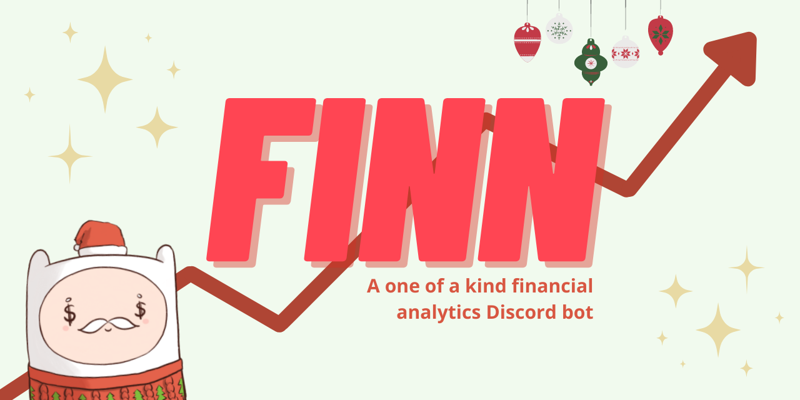

<!-- PROJECT LOGO -->
<br />
<p align="center">
  <a href="https://github.com/Finn-Discord-Bot/finn">
    
  </a>

  <h3 align="center">Finn</h3>
  <h4 align="center"><a href="https://devpost.com/software/finn-u7hden" target="_blank">Devpost Link</a></h4>
  <h4 align="center"><a href="https://invitefinn.tech" target="_blank">» Invite Finn to your Discord server!</a></h4>
  
  <p align="center">
    An all-in-one financial analytics bot to help you gain quantitative financial insights. Finn is a Discord Bot that lets you explore the stock market like you've never before!
    <br />
    <a href="https://github.com/Finn-Discord-Bot/finn#table-of-contents"><strong>Explore the docs »</strong></a>
    <br />
    <br />
    <a href="" target="_blank">View Demo</a>
    ·
    <a href="https://github.com/Finn-Discord-Bot/finn/issues">Report Bug</a>
    ·
    <a href="https://github.com/Finn-Discord-Bot/finn/issues">Request Feature</a>
  </p>
</p>

<!-- TABLE OF CONTENTS -->
<details open="open">
  <summary><h2 style="display: inline-block">Table of Contents</h2></summary>
  <ol>
    <li>
      <a href="#about-the-project">About The Project</a>
      <ul>
        <li><a href="#built-with">Built With</a></li>
      </ul>
    </li>
    <li>
      <a href="#getting-started">Getting Started</a>
      <ul>
        <li><a href="#prerequisites">Prerequisites</a></li>
        <li><a href="#installation">Installation</a></li>
      </ul>
    </li>
    <li><a href="#usage">Usage</a></li>
    <li><a href="#roadmap">Roadmap</a></li>
    <li><a href="#contributing">Contributing</a></li>
    <li><a href="#license">License</a></li>
    <li><a href="#contact">Contact</a></li>
    <li><a href="#acknowledgements">Acknowledgements</a></li>
  </ol>
</details>


<!-- ABOUT THE PROJECT -->
## About The Project

[](https://invitefinn.tech/)

A one-of-a-kind FINNancial analytics Discord bot!

Finn is a bot that seeks to provide a multitude of features to improve financial literacy and smoothen the learning curve that beginners may face coming into finance. By accessing Yahoo Finance’s python library, Finn can provide a wide range of key statistics that new or experienced investors may need when assessing whether to invest in a company. Finn can also help you plan and build a portfolio based on what you need! If you input a list of stock tickers, Finn will algorithmically produce a weighted portfolio of a specified type for your use. 


### Built With

* [discord.py](https://discordpy.readthedocs.io/en/stable/)
* [discord.py-slash-commands](https://discord-py-slash-command.readthedocs.io/en/latest/)
* [DataStax Astra's Apache Cassandra Databases](https://www.datastax.com/products/datastax-astra)
* [Domain.com](https://www.domain.com/)
* [Linode Cloud](https://www.linode.com/)
* [yFinance](https://github.com/ranaroussi/yfinance)


<!-- GETTING STARTED -->
## Getting Started

To get a local copy up and running follow these simple steps.

### Prerequisites

This is an example of how to list things you need to use the software and how to install them.
### Prerequisites

* Python `3.8.x`, `pip3`

1. Update before installing new packages

   ```sh
   sudo apt-get update
   ```
2. Check Python version

   ```sh
   python3 --version
   ```
3. If Python version < `3.8`

   ```sh
   sudo apt install python3.8
   ```
4. Validate

   ```sh
   python3.8 --version
   ```
5. Install `pip3`

   ```sh
   sudo apt-get -y install python3-pip
   ```
6. Validate

   ```sh
   pip3 --version
   ```

### Installation

1. Clone the repo
   ```sh
   git clone https://github.com/Finn-Discord-Bot/finn.git
   ```
2. `cd` into repo directory
   ```sh
   cd finn
   ```
3. Install Prerequisite Libraries
   ```sh
   pip3 install -r requirements.txt
   ```
4. Create a Discord Bot on the [Discord Developer Portal](https://discord.com/developers/applications)
5. Configure [DataStaxAstra Cassandra Database](https://astra.datastax.com/)
    * Initialize CQL Database with keyspace `portfolios`
    * Click on **Connect** in the initialized database. Download and add `secure-connect-database-name.zip` to main directory.
6. Add tokens to `config.json`
  * Copy [tokens](https://astra.datastax.com/settings/tokens) from DataStax Astra Database into `config.json`
  * Bot tokens for Discord can be found in the [Discord Developer Portal](https://discord.com/developers/docs/intro). 
7. Start bot
  ```sh
  python3 main.py
  ```

<!-- USAGE EXAMPLES -->
## Usage


_For more examples, please refer to the [Demo]()_


<!-- ROADMAP -->
## Roadmap

* Web interface to access your portfolio and other features.
* Allow multiple portfolios.
* Enable the ability to purchase the same stock twice in a portfolio.


<!-- CONTRIBUTING -->
## Contributing

Contributions are what make the open source community such an amazing place to be learn, inspire, and create. Any contributions you make are **greatly appreciated**.

1. Fork the Project
2. Create your Feature Branch (`git checkout -b feature/AmazingFeature`)
3. Commit your Changes (`git commit -m 'Add some AmazingFeature'`)
4. Push to the Branch (`git push origin feature/AmazingFeature`)
5. Open a Pull Request


<!-- LICENSE -->
## License

Distributed under the MIT License. See `LICENSE` for more information.


<!-- CONTACT -->
## Contact

Timothy Zheng - [Linkedin](https://www.linkedin.com/in/timothy-zheng21/) - timothyzheng123@gmail.com


Devpost Link: [https://devpost.com/software/finn-u7hden](https://devpost.com/software/finn-u7hden)